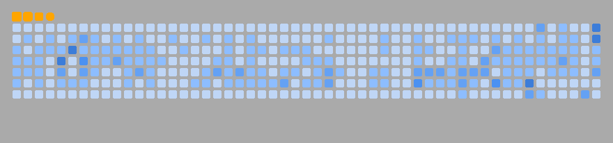

### Hey, I'm Vedant 👋

I build systems that scale, ship, and survive contact with production.  
Part architect, part pragmatist, part chaos-tamer.

- 🫡 Engineer focused on **high-leverage software** and **data-driven platforms**
- 🧠 Deeply curious about **AI (Machine Learning, Computer Vision, Natural Language Processing)**, **Distributed Systems**, and **Big Data**
- 🧱 I like solving hard problems at the intersection of **architecture, reliability, and velocity**
- 🤝 Open to collaborations that are ambitious, technically meaningful, and a little audacious
- 💬 Ask me about system design, backend engineering, ML-in-production, or scaling from 0→1 and 1→N
- ⚡ Fun fact: The Firefox mascot isn't a fox… It's a red panda!

> Build boldly. Measure ruthlessly. Automate everything worth repeating.

*Hakuna automatata!* ✨

## 

<picture>
  <source media="(prefers-color-scheme: dark)" srcset="dist/contributions-dark.svg" />
  <source media="(prefers-color-scheme: light)" srcset="dist/contributions.svg" />
  
</picture>

<picture><embed src=""></embed></picture>

<picture>
  
</picture>

